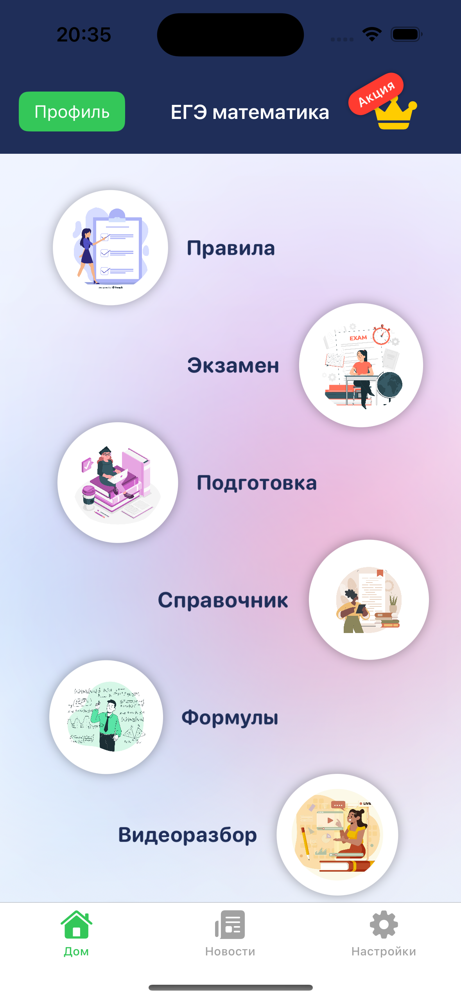
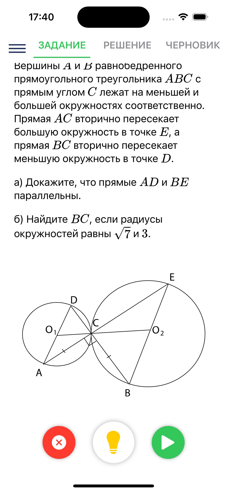
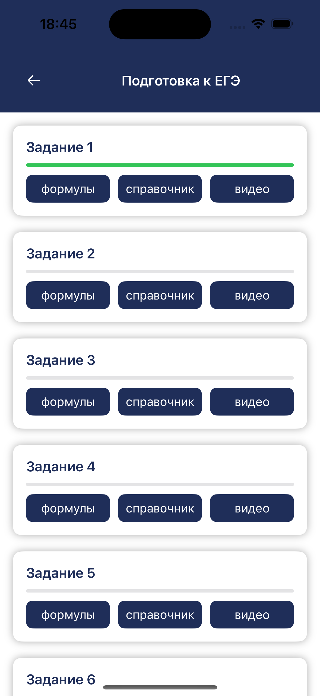

# 📱 Math App Suite — Educational Mobile Apps

Набор мобильных приложений для изучения математики.  
Доступно на **Android (Google Play)** и **iOS (App Store)**.

---

## 🚀 Ссылки на магазины
- [Google Play](https://play.google.com/store/apps/details?id=com.feofanova.mathup)  
- [App Store](https://play.google.com/store/apps/details?id=com.feofanova.mathup)

---

## ✨ Основные функции
- 🎯 Упражнения по арифметике: сложение, вычитание, умножение, деление.  
- 👶 Модули для дошкольников: числа, формы, сравнения.  
- 👨‍👩‍👧 Родительский кабинет: прогресс и отчёты.  
- 📊 Аналитика использования (Firebase + BigQuery).  
- 🌙 Offline-first: можно заниматься без интернета.  

---

## 🛠 Технологии
- **Android:** Kotlin, Canvas/Views, RealmDB.  
- **iOS:** SwiftUI, CoreData.  
- **Backend & Analytics:** Firebase (Auth, Firestore, Crashlytics, Cloud Messaging), BigQuery, Python (pandas + SQL).  
- **CI/CD:** GitHub + Fastlane (автоматизация сборок и публикации).  

---

## 📸 Скриншоты

---

## 📌 О проекте
Эти приложения были разработаны как часть образовательной платформы **FMT Education**, с фокусом на:  
- удобный UX для детей,  
- встроенные механизмы геймификации,  
- родительский контроль и безопасность.  

---
